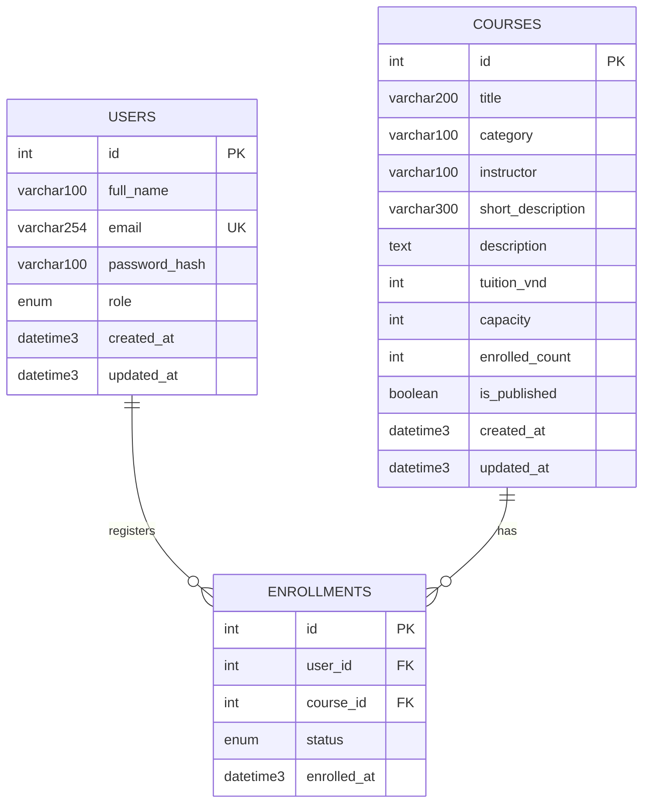

# Database ERD

```mermaid
erDiagram
    USERS ||--o{ ENROLLMENTS : registers
    COURSES ||--o{ ENROLLMENTS : has
    USERS {
        int id PK
        varchar100 full_name
        varchar254 email UK
        varchar100 password_hash
        enum role
        datetime3 created_at
        datetime3 updated_at
    }
    COURSES {
        int id PK
        varchar200 title
        varchar100 category
        varchar100 instructor
        varchar300 short_description
        text description
        int tuition_vnd
        int capacity
        int enrolled_count
        boolean is_published
        datetime3 created_at
        datetime3 updated_at
    }
    ENROLLMENTS {
        int id PK
        int user_id FK
        int course_id FK
        enum status
        datetime3 enrolled_at
    }
```
